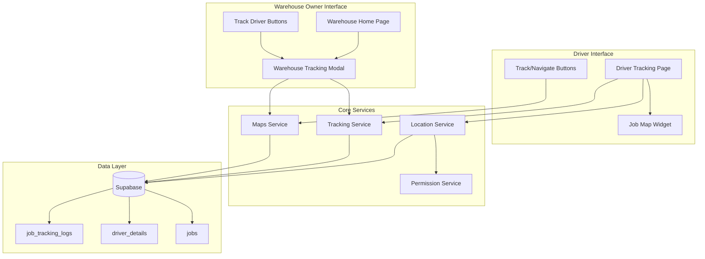
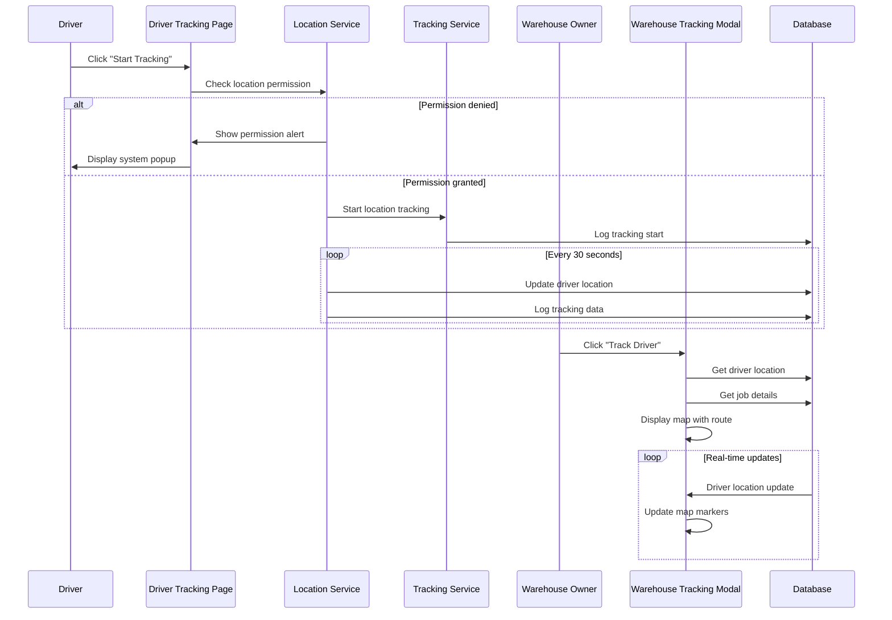

# Enhanced Tracking System Design

## Overview

The Enhanced Tracking System builds upon the existing tracking infrastructure to provide comprehensive real-time location tracking and navigation capabilities. The system enhances both driver and warehouse owner experiences by providing status-based navigation, real-time location updates, proper permission handling, and comprehensive tracking visualization.

The design leverages the existing services (LocationService, TrackingService, MapsService) and extends them with new functionality while maintaining backward compatibility. The system will create new UI components for warehouse owner tracking and enhance existing driver interfaces.

## Architecture

### High-Level Architecture



### Component Interaction Flow



## Components and Interfaces

### 1. Enhanced Location Service

**Purpose**: Extend existing LocationService with permission handling and enhanced location management.

**New Methods**:
- `checkAndRequestLocationPermission()`: Handle permission flow with user-friendly prompts
- `showLocationPermissionAlert()`: Display system-level permission request
- `getCurrentLocationWithPermissionCheck()`: Get location with automatic permission handling
- `startLocationTrackingWithPermissionCheck()`: Enhanced tracking start with permission validation

**Enhanced Methods**:
- `startLocationTracking()`: Add permission checking and error handling
- `getCurrentLocation()`: Add timeout and retry logic

### 2. Enhanced Tracking Service

**Purpose**: Extend existing TrackingService with status-based route management and warehouse owner functionality.

**New Methods**:
- `getDriverLocationForWarehouse(jobId)`: Get driver location for warehouse owner tracking
- `getStatusBasedRoute(jobId, driverLocation)`: Get route based on job status
- `startWarehouseTracking(jobId)`: Initialize tracking for warehouse owner view
- `stopWarehouseTracking(jobId)`: Stop warehouse owner tracking session

**Enhanced Methods**:
- `startJobTracking()`: Add permission checking and enhanced error handling
- `getRouteProgress()`: Add status-based route calculation

### 3. Enhanced Maps Service

**Purpose**: Extend existing MapsService with enhanced visualization and warehouse owner specific functionality.

**New Methods**:
- `createWarehouseTrackingMarkers()`: Create markers for warehouse owner tracking view
- `createStatusBasedRoute()`: Create route based on job status (pickup vs destination)
- `getRouteForStatus()`: Get appropriate route based on job status
- `createTrackingPolyline()`: Create enhanced polyline with status-based styling

**Enhanced Methods**:
- `createJobMarkers()`: Add enhanced marker styling and info windows
- `getCameraBounds()`: Add intelligent bounds calculation for different tracking scenarios

### 4. New Permission Service

**Purpose**: Handle location permission requests and system-level permission management.

**Methods**:
- `requestLocationPermission()`: Request location permission with proper error handling
- `showPermissionDialog()`: Show user-friendly permission explanation
- `openLocationSettings()`: Open system location settings
- `checkLocationServiceStatus()`: Check if location services are enabled
- `handlePermissionDenied()`: Handle permission denial scenarios

### 5. Enhanced Job Map Widget

**Purpose**: Extend existing JobMapWidget with status-based functionality and real-time updates.

**New Properties**:
- `trackingMode`: Enum for different tracking modes (driver, warehouse_assigned, warehouse_transit)
- `showCurrentLocation`: Boolean to show driver's current location
- `autoUpdateLocation`: Boolean for real-time location updates
- `statusBasedRoute`: Boolean to show route based on job status

**Enhanced Methods**:
- `_initializeMap()`: Add current location initialization
- `_loadRoute()`: Add status-based route loading
- `_startLocationUpdates()`: Add real-time location updates
- `_updateTrackingView()`: Update view based on tracking mode

### 6. New Warehouse Tracking Modal

**Purpose**: New component for warehouse owner tracking interface.

**Properties**:
- `job`: Job object with tracking information
- `trackingMode`: Current tracking mode (assigned/transit)
- `realTimeUpdates`: Enable/disable real-time updates

**Methods**:
- `initializeTracking()`: Initialize tracking view
- `loadDriverLocation()`: Load current driver location
- `updateTrackingView()`: Update tracking visualization
- `handleLocationUpdate()`: Handle real-time location updates
- `showTrackingInfo()`: Display tracking information panel

### 7. Enhanced Driver Tracking Page

**Purpose**: Enhance existing JobTrackingPage with improved permission handling and status-based navigation.

**New Methods**:
- `_checkLocationPermission()`: Check and request location permission
- `_showPermissionAlert()`: Show location permission alert
- `_getStatusBasedRoute()`: Get route based on current job status
- `_handlePermissionDenied()`: Handle permission denial

**Enhanced Methods**:
- `_startTracking()`: Add permission checking
- `_initializeTracking()`: Add current location display
- `_loadRoute()`: Add status-based route loading

## Data Models

### Enhanced Job Model

```dart
class Job {
  // Existing fields...
  
  // Enhanced tracking fields
  bool isTrackingActive;
  DateTime? trackingStartedAt;
  DateTime? pickupEta;
  DateTime? deliveryEta;
  double? routeDistance;
  int? estimatedTravelTime;
  
  // Location coordinates (if not already present)
  double? pickupLat;
  double? pickupLng;
  double? destinationLat;
  double? destinationLng;
}
```

### New Tracking Session Model

```dart
class TrackingSession {
  final String id;
  final String jobId;
  final String driverId;
  final String? warehouseOwnerId;
  final TrackingMode mode;
  final bool isActive;
  final DateTime startedAt;
  final DateTime? endedAt;
  
  TrackingSession({
    required this.id,
    required this.jobId,
    required this.driverId,
    this.warehouseOwnerId,
    required this.mode,
    required this.isActive,
    required this.startedAt,
    this.endedAt,
  });
}

enum TrackingMode {
  driver,
  warehouseAssigned,
  warehouseTransit,
}
```

### Enhanced Driver Location Model

```dart
class DriverLocation {
  final String driverId;
  final double latitude;
  final double longitude;
  final double? speed;
  final double? heading;
  final double? accuracy;
  final DateTime timestamp;
  final String jobStatus;
  
  DriverLocation({
    required this.driverId,
    required this.latitude,
    required this.longitude,
    this.speed,
    this.heading,
    this.accuracy,
    required this.timestamp,
    required this.jobStatus,
  });
}
```

## Error Handling

### Location Permission Errors

```dart
enum LocationPermissionError {
  denied,
  deniedForever,
  serviceDisabled,
  timeout,
  unknown,
}

class LocationPermissionException implements Exception {
  final LocationPermissionError type;
  final String message;
  final String? solution;
  
  LocationPermissionException(this.type, this.message, [this.solution]);
}
```

### Tracking Errors

```dart
enum TrackingError {
  permissionDenied,
  locationServiceDisabled,
  networkError,
  databaseError,
  invalidJobStatus,
  driverNotFound,
}

class TrackingException implements Exception {
  final TrackingError type;
  final String message;
  final String? jobId;
  
  TrackingException(this.type, this.message, [this.jobId]);
}
```

### Error Handling Strategy

1. **Permission Errors**: Show user-friendly dialogs with clear instructions
2. **Network Errors**: Implement retry logic with exponential backoff
3. **Location Errors**: Provide fallback options and clear error messages
4. **Database Errors**: Log errors and show generic user-friendly messages

## Testing Strategy

### Unit Tests

1. **Location Service Tests**:
   - Permission checking logic
   - Location retrieval with various scenarios
   - Error handling for different permission states

2. **Tracking Service Tests**:
   - Status-based route calculation
   - Real-time location updates
   - Warehouse owner tracking functionality

3. **Maps Service Tests**:
   - Marker creation for different scenarios
   - Route calculation based on job status
   - Camera bounds calculation

### Integration Tests

1. **Driver Tracking Flow**:
   - Complete tracking session from start to finish
   - Permission handling integration
   - Status-based navigation

2. **Warehouse Owner Tracking Flow**:
   - Tracking initialization for different job statuses
   - Real-time location updates
   - Multi-location visualization

3. **Database Integration**:
   - Tracking data logging
   - Location updates
   - Job status transitions

### Widget Tests

1. **Job Map Widget**:
   - Map initialization with current location
   - Status-based route display
   - Real-time location updates

2. **Warehouse Tracking Modal**:
   - Modal initialization
   - Location marker display
   - Route visualization

3. **Driver Tracking Page**:
   - Permission request flow
   - Tracking controls
   - Status-based navigation buttons

### End-to-End Tests

1. **Complete Driver Journey**:
   - Job assignment to completion with tracking
   - Permission handling
   - Status transitions

2. **Warehouse Owner Monitoring**:
   - Tracking drivers through different job statuses
   - Real-time updates
   - Multiple job tracking

## Performance Considerations

### Location Updates

- **Frequency**: Update driver location every 30 seconds during active tracking
- **Batching**: Batch location updates to reduce database calls
- **Caching**: Cache recent location data to reduce API calls

### Map Rendering

- **Lazy Loading**: Load map components only when needed
- **Marker Optimization**: Reuse marker instances where possible
- **Route Caching**: Cache route calculations for similar requests

### Database Optimization

- **Indexing**: Ensure proper indexes on tracking-related queries
- **Connection Pooling**: Use connection pooling for database operations
- **Query Optimization**: Optimize queries for real-time location updates

### Memory Management

- **Timer Management**: Properly dispose of location update timers
- **Stream Subscriptions**: Cancel location streams when not needed
- **Widget Disposal**: Properly dispose of map controllers and subscriptions

## Security Considerations

### Location Data Privacy

- **Data Encryption**: Encrypt location data in transit and at rest
- **Access Control**: Implement proper RLS policies for location data
- **Data Retention**: Implement data retention policies for tracking logs

### Permission Handling

- **Graceful Degradation**: Provide functionality even with limited permissions
- **User Consent**: Clearly explain why location permission is needed
- **Permission Persistence**: Handle permission state changes gracefully

### API Security

- **Rate Limiting**: Implement rate limiting for location update APIs
- **Authentication**: Ensure all tracking APIs require proper authentication
- **Input Validation**: Validate all location and tracking data inputs

## Deployment Considerations

### Database Migrations

- **Schema Updates**: Update database schema for enhanced tracking fields
- **Data Migration**: Migrate existing tracking data if needed
- **Index Creation**: Create new indexes for performance optimization

### Feature Flags

- **Gradual Rollout**: Use feature flags for gradual rollout of new tracking features
- **A/B Testing**: Test different tracking UI approaches
- **Rollback Strategy**: Implement rollback strategy for tracking features

### Monitoring

- **Location Accuracy**: Monitor location accuracy and update frequency
- **Permission Success Rate**: Track permission grant/denial rates
- **Tracking Session Duration**: Monitor tracking session lengths and success rates
- **Error Rates**: Monitor error rates for different tracking scenarios